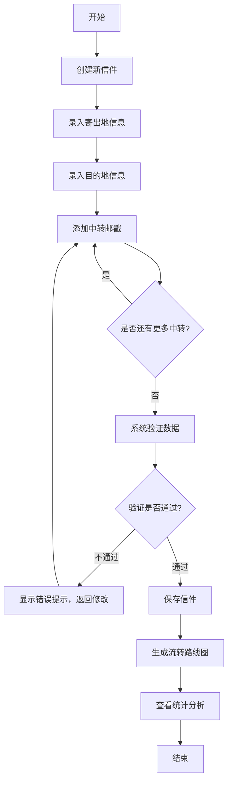

## 1. 产品概述

邮政史研究工具是一款面向邮政史研究人员的专业应用，用于整理旧信封邮戳信息并还原历史邮件的流转路线。通过数字化手段记录邮戳地点、日期和清晰度等信息，在地图上可视化呈现邮件流转路径，帮助研究者分析邮政网络运作规律。

- 目标用户：邮政史研究人员、集邮爱好者、历史学者
- 核心价值：将散落的邮戳信息系统化，通过地图可视化和统计分析揭示历史邮政网络特征

## 2. 核心功能

### 2.1 用户角色

| 角色 | 注册方式 | 核心权限 |
|------|----------|----------|
| 研究人员 | 本地应用，无需注册 | 录入信件信息、管理邮戳记录、查看流转地图、浏览统计数据 |

### 2.2 功能模块

1. **信件管理**：信件列表、新增信件、编辑信件、删除信件
2. **邮戳录入**：寄出地与目的地录入、中转邮戳管理、日期与清晰度设置
3. **地图可视化**：Leaflet 地图展示、流转路线绘制、各段耗时标注、异常节点标记
4. **统计分析**：常见中转城市排行、平均流转时长统计、ngx-charts 图表展示

### 2.3 页面详情

| 页面名称 | 模块名称 | 功能描述 |
|----------|----------|----------|
| 信件列表页 | 信件卡片列表 | 展示所有录入信件，支持搜索和筛选 |
| 信件详情/编辑页 | 信件信息表单 | 编辑信件基本信息，管理寄出地、目的地和中转邮戳 |
| 流转地图页 | Leaflet 地图组件 | 按时间顺序连接中转地点，显示各段耗时、异常绕行和缺失节点 |
| 统计分析页 | ngx-charts 图表 | 展示常见中转城市和平均流转时长统计 |

## 3. 核心流程

用户主要流程：录入信件信息 → 添加邮戳记录 → 系统验证数据合法性 → 生成流转路线图 → 查看统计分析

## 4. 用户界面设计

### 4.1 设计风格

- **主色调**：深褐色系 (#5D4037)，呼应旧信封的复古感
- **辅助色**：深青色 (#006064)，用于强调和交互元素
- **中性色**：米白色背景 (#F5F0E1)，营造复古纸张质感
- **按钮风格**：圆角矩形，轻微阴影，悬停时有深度变化
- **字体**：Google Fonts - Playfair Display（标题） + Source Serif Pro（正文），衬线字体体现历史感
- **布局风格**：卡片式布局，Angular Material 组件，顶部导航栏
- **图标风格**：Material Icons，线条简约

### 4.2 页面设计概览

| 页面名称 | 模块名称 | UI 元素 |
|----------|----------|---------|
| 信件列表页 | 顶部导航 + 信件卡片网格 | 复古色调、卡片悬浮效果、搜索栏 |
| 信件编辑页 | 表单 + 邮戳列表 | Material 表单控件、动态添加行、验证提示 |
| 流转地图页 | 地图 + 侧边信息栏 | 全屏地图、路线动画、信息面板 |
| 统计分析页 | 柱状图 + 饼图 | ngx-charts 组件、数据可视化 |

### 4.3 响应式

桌面端优先设计，移动端自适应布局。地图区域在小屏幕上调整为垂直堆叠，侧边信息栏转为底部抽屉。

### 4.4 地图交互

- 地图默认居中显示所有相关地点
- 点击邮戳点显示详细信息弹窗
- 流转路线使用渐变色表示时间推进
- 异常节点使用特殊图标和颜色标注
