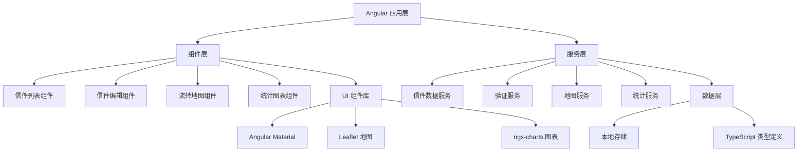
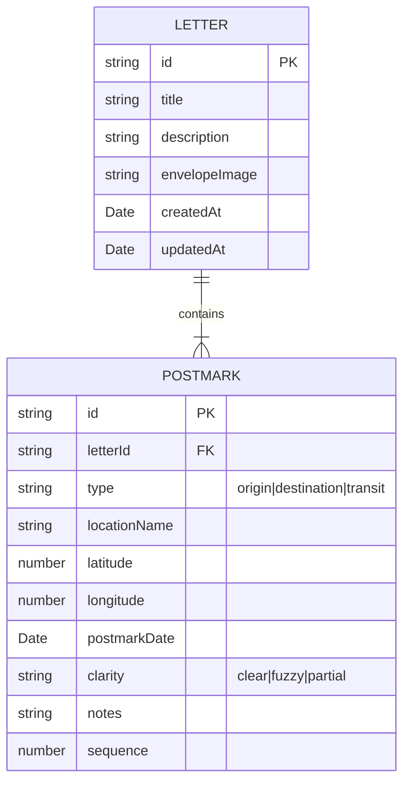

## 1. 架构设计

本项目为纯前端单页应用，采用 Angular 框架构建，数据存储于浏览器本地存储 (localStorage)。



## 2. 技术描述

- **前端框架**：Angular 17 + TypeScript
- **UI 组件库**：Angular Material 17
- **地图库**：Leaflet 1.9 + @asymmetrik/ngx-leaflet
- **图表库**：@swimlane/ngx-charts 20
- **状态管理**：Angular 服务 + RxJS
- **数据持久化**：localStorage
- **构建工具**：Angular CLI
- **样式方案**：SCSS + Angular Material 主题定制

## 3. 路由定义

| 路由 | 页面 | 用途 |
|------|------|------|
| /letters | 信件列表页 | 展示所有录入的信件 |
| /letters/new | 新建信件页 | 创建新的信件记录 |
| /letters/:id/edit | 信件编辑页 | 编辑现有信件信息 |
| /letters/:id/map | 流转地图页 | 查看信件流转路线图 |
| /statistics | 统计分析页 | 展示统计数据和图表 |
| ** | 重定向到 /letters | 默认路由 |

## 4. 数据模型

### 4.1 数据模型定义



### 4.2 TypeScript 类型定义

```typescript
export interface Location {
  name: string;
  latitude: number;
  longitude: number;
}

export type PostmarkType = 'origin' | 'destination' | 'transit';
export type PostmarkClarity = 'clear' | 'fuzzy' | 'partial';

export interface Postmark {
  id: string;
  letterId: string;
  type: PostmarkType;
  locationName: string;
  latitude: number | null;
  longitude: number | null;
  postmarkDate: string | null;
  clarity: PostmarkClarity;
  notes?: string;
  sequence: number;
}

export interface Letter {
  id: string;
  title: string;
  description?: string;
  postmarks: Postmark[];
  createdAt: string;
  updatedAt: string;
}

export interface RouteSegment {
  from: Postmark;
  to: Postmark;
  durationDays: number | null;
  isAnomaly: boolean;
  anomalyReason?: string;
}

export interface ValidationResult {
  valid: boolean;
  errors: ValidationError[];
  warnings: ValidationWarning[];
}

export interface ValidationError {
  type: string;
  message: string;
  postmarkId?: string;
}

export interface ValidationWarning {
  type: string;
  message: string;
  postmarkId?: string;
}
```

## 5. 验证规则

### 5.1 强制性验证（错误）

1. **日期递增验证**：邮戳日期必须按流转顺序严格递增
2. **重复记录验证**：同一封信中不能存在两个完全相同的中转记录（地点+日期完全一致）
3. **经纬度合法性验证**：纬度范围 [-90, 90]，经度范围 [-180, 180]
4. **时间倒序禁止生成路线图**：如果存在时间倒序，不能生成正式流转图

### 5.2 提示性验证（警告）

1. **缺失日期标记**：缺少日期的邮戳需要单独标记
2. **缺失地点标记**：缺少地点（经纬度）的邮戳需要单独标记
3. **异常绕行检测**：路线出现明显绕行时给出提示

## 6. 项目目录结构

```
src/
├── app/
│   ├── components/
│   │   ├── letter-list/
│   │   ├── letter-edit/
│   │   ├── postmark-form/
│   │   ├── route-map/
│   │   ├── statistics/
│   │   └── layout/
│   ├── services/
│   │   ├── letter.service.ts
│   │   ├── validation.service.ts
│   │   └── statistics.service.ts
│   ├── models/
│   │   └── letter.model.ts
│   ├── app-routing.module.ts
│   ├── app.component.ts
│   └── app.module.ts
├── assets/
├── environments/
├── styles.scss
└── main.ts
```
